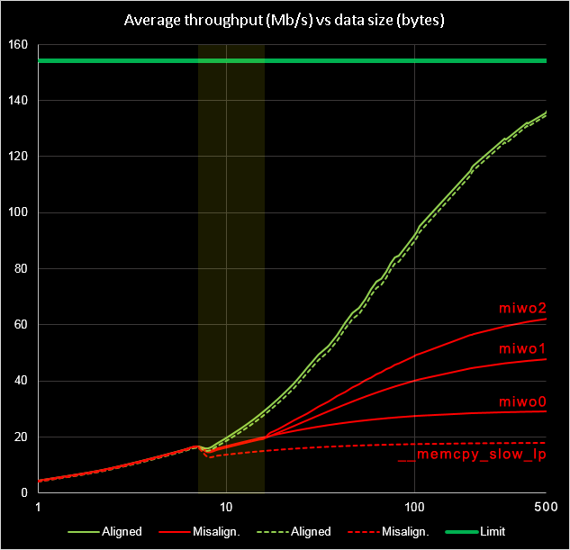

# Sample program to test & benchmark my fast memcpy for ARMv6M

hen using unaligned data, this new memcpy is between 1.5x and 3.5x faster than the default ROM version of Raspberry Pi Pico (RP2040).   
For aligned data, it is just 8 cycles faster.

The following graph shows the average throughput compared to the default ROM version (in dashed lines):

 - Green lines: data aligned at word (4 byte) boundary (both source & destination).
 - Red lines: not aligned data.
 
There are 3 versions (mivo0, miwo1 & miwo2) with increasing speed.

See more details in my blog: 
https://visenri.users.sourceforge.net/blog/2024/mempy_replacement_for_armv6-Part1

The .vscode folder contains my settings, replace it with your own in case of problems.
